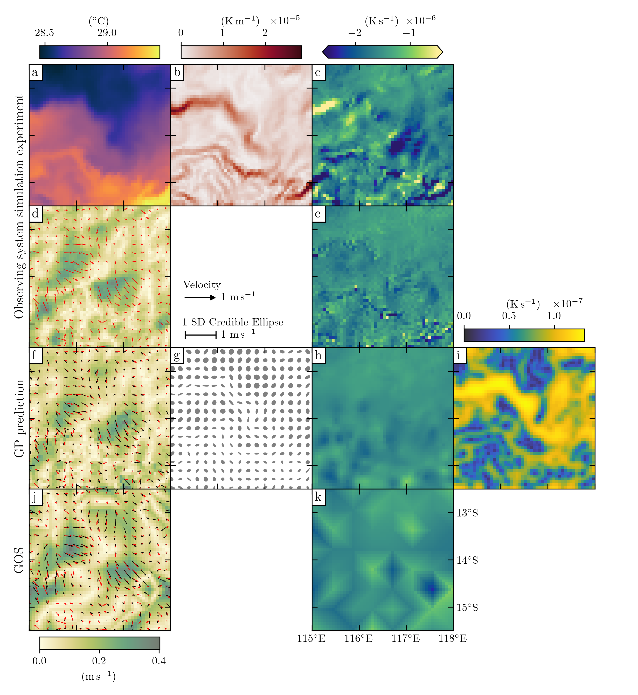

# inversion-sst-gp




Physics-informed Gaussian process inversion of sea surface temperature to predict submesoscale near-surface ocean currents, based on the paper by Rick de Kreij et al.

We present a novel method to estimate fine-scale ocean surface currents using satellite sea surface temperature (SST) data. Our approach uses Gaussian process (GP) regression guided by the tracer transport equation, providing not only current predictions but also associated uncertainty. The model effectively handles noisy and incomplete SST data (e.g., due to cloud cover).

This repository contains all code and data to reproduce the experiments and results presented in the paper, including the observing system simulation experiment (OSSE) and real-world satellite SST applications.

---

## Instructions

To reproduce the results, please follow these steps:

1. **Clone this repository** and navigate to the project root.

2. **Install package:**  
    - Recommended: set up a virtual environment using [Poetry](https://python-poetry.org/docs/) and run  
      ```bash
      poetry install
      ```  
    - Alternative: install the package with pip  
      ```bash
      pip install ./pkg
      ```

3. **Prepare the data:** Download the preprocessed NetCDF files of the SUNTANS, Himawari-9, and altimetry derived currents as stated in the [1_preproc_data/README.md](1_preproc_data/README.md).

4. **Run the project sequentially:** After placing the data, cycle through the folders `1_`, `2_`, etc., running the code in each folder in order. Output data and figures will be saved in subfolders such as `proc_data/`, `intermediate/`, `outputs/`, and `figures/`. These are reused or referenced in downstream scripts and notebooks. **Note:** For convenience, the relevant output files and figures are already included in these subfolders, so you can explore the results without having to re-run every step.


## Abstract

Direct in situ measurements of sea surface currents (SSC) at submesoscales (1-100 km) are challenging. For this reason, one often employs inversion techniques to infer SSC from temperature data, which are straightforward to obtain. However, existing inversion methods have a limited consideration of the underlying physical processes, and do not adequately account for uncertainty. Here, we present a physics-based statistical inversion model to predict submesoscale SSC using remotely sensed sea surface temperature (SST) data. Our approach employs Gaussian process (GP) regression that is informed by a two-dimensional tracer transport equation. Our method yields a predictive distribution of SSC, from which we can generate an ensemble of SSC to construct both predictions and prediction intervals. Our approach incorporates prior knowledge of the SSC length scales and variances elicited from a numerical model; these are subsequently refined using the SST data. The framework naturally handles noisy and spatially irregular SST data (e.g., due to cloud cover), without the need for pre-filtering.  We validate the inversion model through an observing system simulation experiment, which demonstrates that GP-based statistical inversion outperforms existing methods, especially when the measurement signal-to-noise ratio is low.  When applied to Himawari-9 satellite SST data over the eastern Indian Ocean, our method successfully resolves SSC down to the sub-mesoscale. We anticipate our framework will be used to improve understanding of fine-scale ocean dynamics, and to facilitate the coherent propagation of uncertainty into downstream applications such as ocean particle tracking.